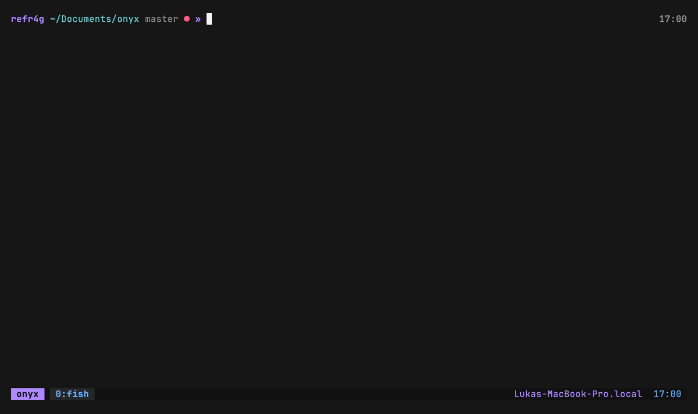

<h1 align="center">onyx</h1>

<p align="center"><em>An <strong>oxocarbon</strong>-themed terminal &amp; neovim setup — fish · tmux · bat · eza · neovim</em></p>

<p align="center">
  
</p>

<p align="center">
  
  
  
  
</p>

## Features

- 🎨 **One palette everywhere** — oxocarbon across fish, tmux, bat, eza and neovim
- 🐟 **fish** — syntax-colored typing + a two-line, git-aware prompt
- 🪟 **tmux** — themed status bar, prefix `C-a`, `o`/`k` splits, mouse on
- 📄 **bat** — custom oxocarbon theme, `cat` → bat
- 📁 **eza** — true-hex colored `ls` with a git status column
- ⌨️ **neovim** — lazy.nvim + native LSP (Python · PHP · JS/TS · Java · C/C++) + treesitter
- 🔒 **safe** — credentials kept out of the repo via a git-ignored `secrets.fish`
- 💻 **portable** — one installer for macOS **and** Linux

## Install

```sh
git clone <your-repo-url> ~/Documents/onyx
cd ~/Documents/onyx
./install.sh
```

| Flag | Effect |
|------|--------|
| `--no-deps` | only symlink configs, skip package installation |
| `--font`    | also install JetBrainsMono Nerd Font (icons are off by default) |
| `--shell`   | set fish as the default login shell |
| `--no-nvim` | skip the neovim plugin bootstrap |

The installer detects your package manager (**brew / apt / dnf / pacman / zypper**),
installs missing tools (with release-binary fallbacks for `eza` and `neovim` when a
distro ships them too old), backs up any existing config to `*.bak.<timestamp>`,
then symlinks each file individually (so plugin managers like omf keep working).

## What it sets up

| Tool | Config | Notes |
|------|--------|-------|
| fish | `fish/config.fish`, `conf.d/*.fish`, `functions/*.fish` | oxocarbon syntax palette, two-line prompt, eza/bat aliases |
| tmux | `tmux/tmux.conf` | oxocarbon status bar; prefix `C-a`, `o`/`k` splits, mouse on |
| bat  | `bat/config`, `bat/themes/oxocarbon.tmTheme` | custom oxocarbon theme |
| eza  | `EZA_COLORS` in `conf.d/output-colors.fish` | true-hex oxocarbon `ls` (icons off) |
| neovim | `nvim/init.lua` | lazy.nvim, oxocarbon.nvim, treesitter, native LSP |

**Neovim LSP** (auto-installed via mason on first launch):
`pyright` · `intelephense` · `ts_ls` · `jdtls` · `clangd`.

## Keybindings

**tmux** (prefix `C-a`)

| Key | Action |
|-----|--------|
| `o` | split horizontally |
| `k` | split vertically |

**neovim** (leader = `\`)

| Key | Action | | Key | Action |
|-----|--------|---|-----|--------|
| `F6` | toggle file tree | | `gd` | go to definition |
| `F3` / `F5` | show / hide line numbers | | `gr` | references |
| `<leader><space>` | clear search highlight | | `K` | hover docs |
| `zf2j` | toggle fold | | `<leader>rn` | rename |
| `[d` / `]d` | prev / next diagnostic | | `<leader>ca` | code action |

## Secrets

`config.fish` never stores credentials. Copy the template and fill it in:

```sh
cp fish/secrets.fish.example ~/.config/fish/secrets.fish
# then edit ~/.config/fish/secrets.fish  (set -gx KALI_SSH_PASS "…")
```

`secrets.fish` is git-ignored.

## Runtimes you may still need

- **Java** (jdtls): a JDK 17+ on PATH
- **Node** (pyright / ts_ls / intelephense): Node.js
- **PHP** (intelephense): the `php` CLI helps for some features

## Regenerating the demo

The GIF is produced headlessly with [VHS](https://github.com/charmbracelet/vhs):

```sh
cd ~/Documents/onyx && vhs assets/demo.tape
```

## Uninstall / revert

Every replaced file was saved as `*.bak.<timestamp>` next to the symlink —
remove the symlink and move the backup back.

## Per-OS notes

- **Debian/Ubuntu**: `bat` ships as `batcat`; the installer symlinks it to `~/.local/bin/bat`.
- **Older distros**: `eza`/`neovim` fall back to GitHub release binaries in `~/.local/bin`.
- **Neovim** must be ≥ 0.11 (native LSP API); the installer upgrades it if needed.

## Credits

- [oxocarbon.nvim](https://github.com/nyoom-engineering/oxocarbon.nvim) — the theme
- [lazy.nvim](https://github.com/folke/lazy.nvim) · [nvim-treesitter](https://github.com/nvim-treesitter/nvim-treesitter) · [mason.nvim](https://github.com/williamboman/mason.nvim) · [nvim-cmp](https://github.com/hrsh7th/nvim-cmp) · [lualine](https://github.com/nvim-lualine/lualine.nvim) · [nvim-tree](https://github.com/nvim-tree/nvim-tree.lua)
- [eza](https://github.com/eza-community/eza) · [bat](https://github.com/sharkdp/bat) · [fish](https://fishshell.com) · [tmux](https://github.com/tmux/tmux)
